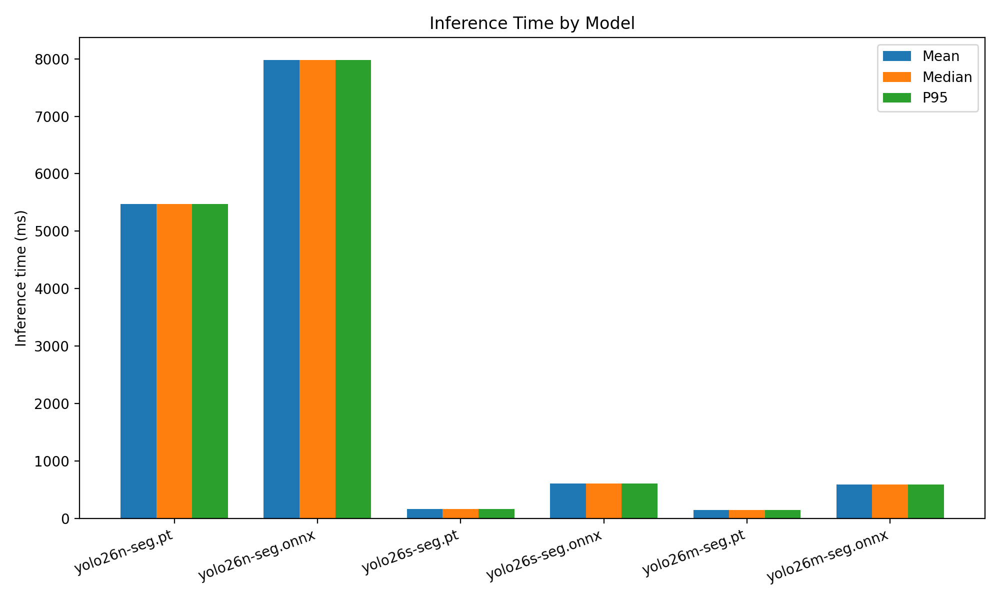
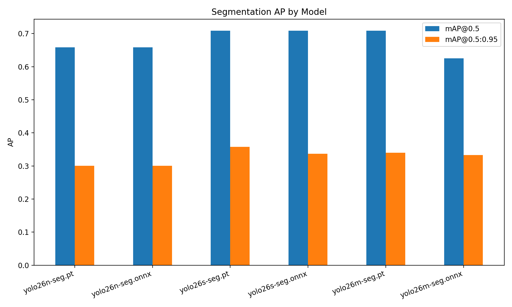
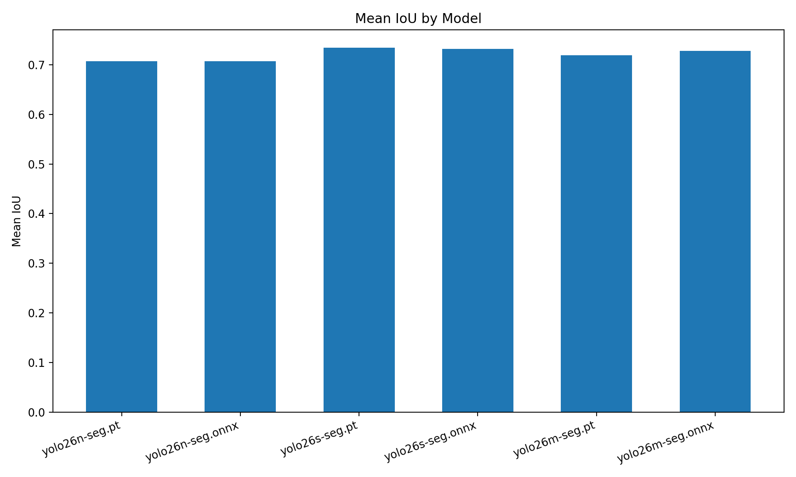
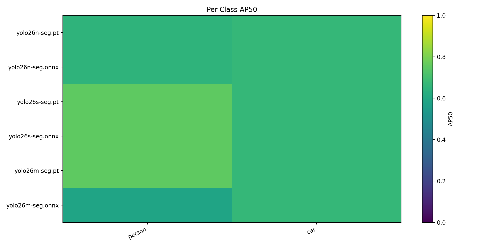

# Cityscapes Segmentation Benchmark

- Dataset root: `/home/intellisense05/akinduid/mi/datasets`
- Split: `val`
- Image pairs evaluated: `1`
- Max images: `1`

## Summary

| Model            | Mean ms | Median ms | P95 ms  | FPS  | Mean IoU | Prec@0.5 | Rec@0.5 | F1@0.5 | mAP@0.5 | mAP@0.5:0.95 | Eval mode   | Best F1@0.5 | Best conf@0.5 |
| ---------------- | ------- | --------- | ------- | ---- | -------- | -------- | ------- | ------ | ------- | ------------ | ----------- | ----------- | ------------- |
| yolo26n-seg.pt   | 5469.44 | 5469.44   | 5469.44 | 0.18 | 0.7073   | 0.0488   | 0.7083  | 0.0911 | 0.6583  | 0.3007       | class-aware | 0.0000      | 0.0000        |
| yolo26n-seg.onnx | 7975.65 | 7975.65   | 7975.65 | 0.13 | 0.7075   | 0.0467   | 0.7083  | 0.0873 | 0.6583  | 0.3007       | class-aware | 0.0000      | 0.0000        |
| yolo26s-seg.pt   | 157.30  | 157.30    | 157.30  | 6.36 | 0.7340   | 0.0482   | 0.7083  | 0.0899 | 0.7083  | 0.3579       | class-aware | 0.0000      | 0.0000        |
| yolo26s-seg.onnx | 606.38  | 606.38    | 606.38  | 1.65 | 0.7320   | 0.0445   | 0.7083  | 0.0836 | 0.7083  | 0.3366       | class-aware | 0.0000      | 0.0000        |
| yolo26m-seg.pt   | 143.02  | 143.02    | 143.02  | 6.99 | 0.7192   | 0.0761   | 0.7083  | 0.1369 | 0.7083  | 0.3396       | class-aware | 0.0000      | 0.0000        |
| yolo26m-seg.onnx | 587.11  | 587.11    | 587.11  | 1.70 | 0.7282   | 0.0726   | 0.7083  | 0.1315 | 0.6250  | 0.3327       | class-aware | 0.0000      | 0.0000        |

Engine models may use class-agnostic fallback when class/conf fields are incompatible.

## Plots

## Per-Class AP50

| Model            | person | car    |
| ---------------- | ------ | ------ |
| yolo26n-seg.pt   | 0.6500 | 0.6667 |
| yolo26n-seg.onnx | 0.6500 | 0.6667 |
| yolo26s-seg.pt   | 0.7500 | 0.6667 |
| yolo26s-seg.onnx | 0.7500 | 0.6667 |
| yolo26m-seg.pt   | 0.7500 | 0.6667 |
| yolo26m-seg.onnx | 0.5833 | 0.6667 |

## Threshold View

| Model            | Best F1@0.5 | Best conf@0.5 |
| ---------------- | ----------- | ------------- |
| yolo26n-seg.pt   | 0.0000      | 0.0000        |
| yolo26n-seg.onnx | 0.0000      | 0.0000        |
| yolo26s-seg.pt   | 0.0000      | 0.0000        |
| yolo26s-seg.onnx | 0.0000      | 0.0000        |
| yolo26m-seg.pt   | 0.0000      | 0.0000        |
| yolo26m-seg.onnx | 0.0000      | 0.0000        |

## Outputs

- JSON: [`benchmark_results.json`](benchmark_results.json)
- CSV: [`benchmark_results.csv`](benchmark_results.csv)
- Plots directory: [`plots/`](plots)