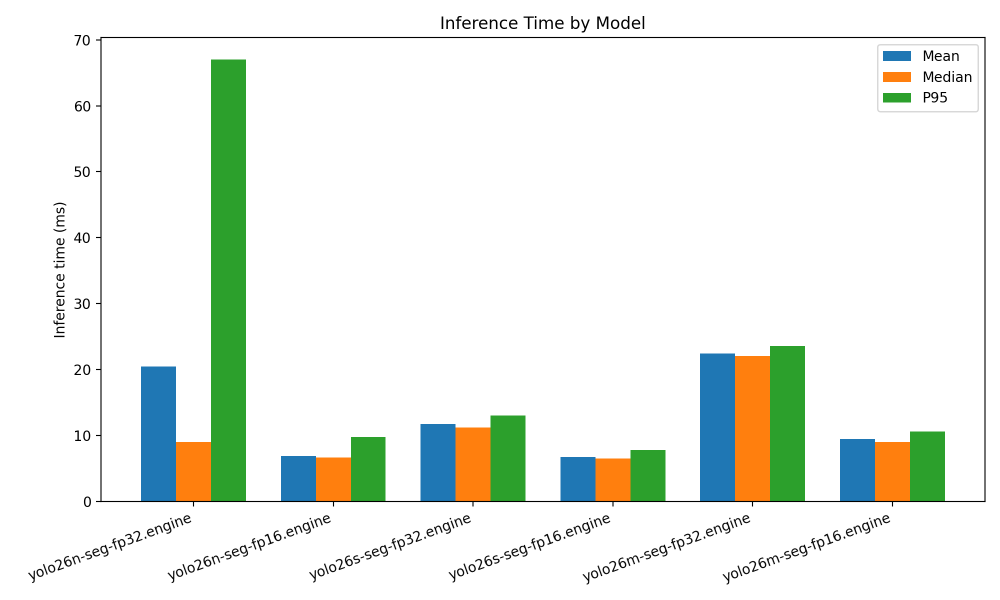
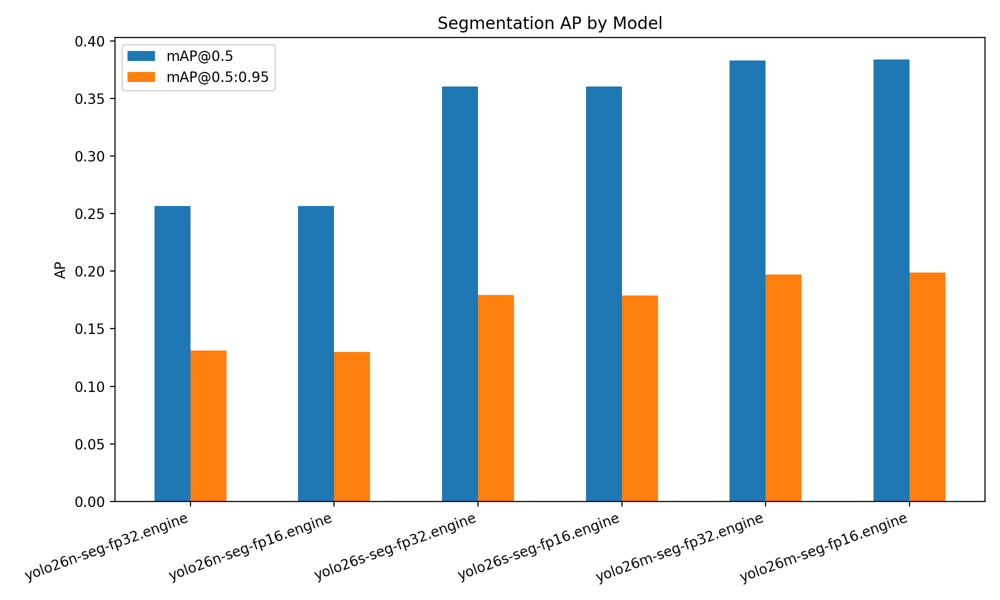
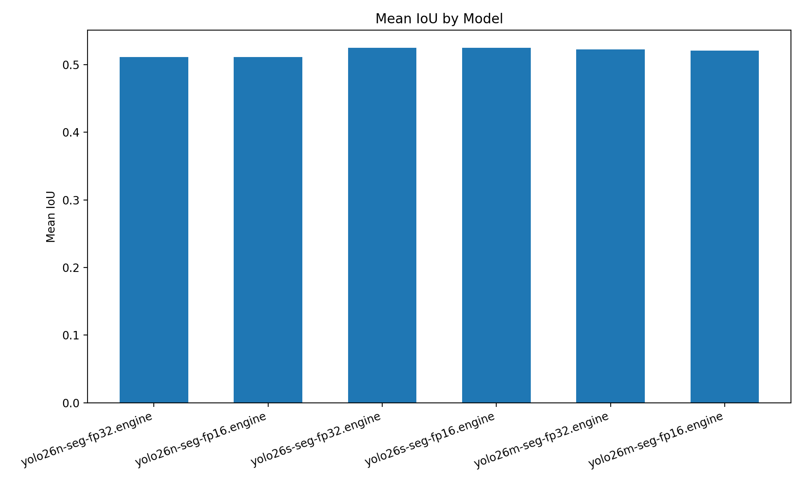
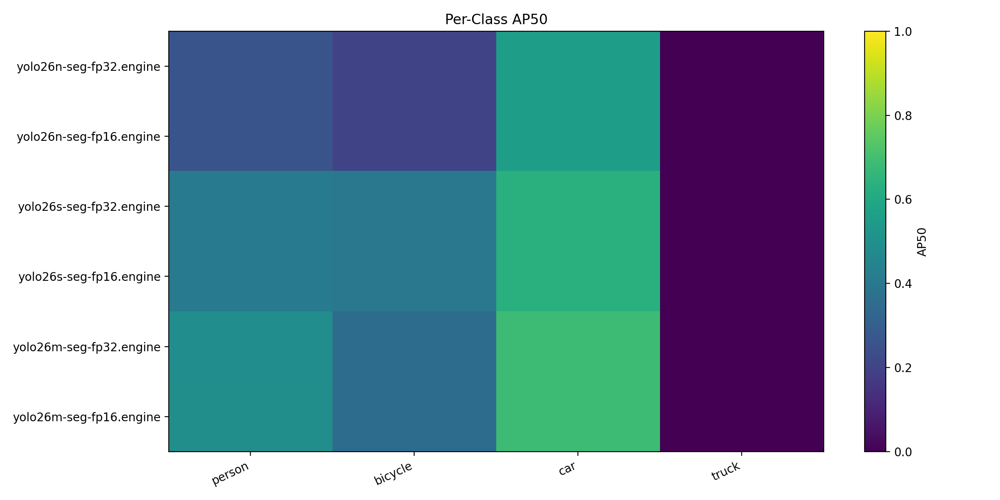
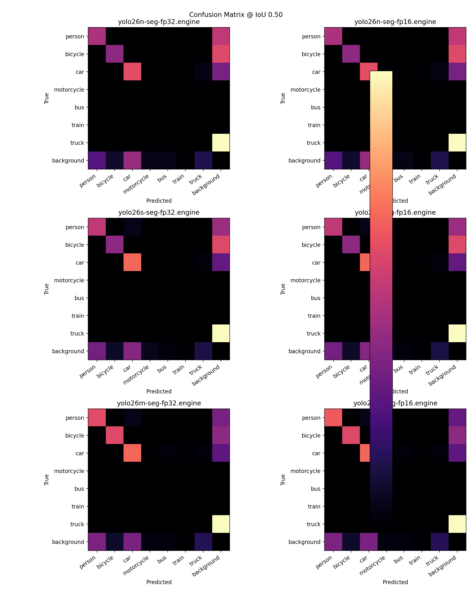

# Cityscapes Segmentation Benchmark

- Dataset root: `/home/intellisense05/akinduid/mi/datasets`
- Split: `val`
- Image pairs evaluated: `5`
- Max images: `5`

## Summary

| Model                   | Mean ms | Median ms | P95 ms | FPS    | Mean IoU | Prec@0.5 | Rec@0.5 | F1@0.5 | mAP@0.5 | mAP@0.5:0.95 | Eval mode              | Best F1@0.5 | Best conf@0.5 |
| ----------------------- | ------- | --------- | ------ | ------ | -------- | -------- | ------- | ------ | ------- | ------------ | ---------------------- | ----------- | ------------- |
| yolo26n-seg-fp32.engine | 20.45   | 9.00      | 67.04  | 48.89  | 0.5116   | 0.0353   | 0.3821  | 0.0641 | 0.2567  | 0.1309       | native-trt-class-aware | 0.3390      | 0.3079        |
| yolo26n-seg-fp16.engine | 6.86    | 6.65      | 9.76   | 145.73 | 0.5116   | 0.0354   | 0.3821  | 0.0643 | 0.2569  | 0.1296       | native-trt-class-aware | 0.3405      | 0.3087        |
| yolo26s-seg-fp32.engine | 11.76   | 11.22     | 13.06  | 85.06  | 0.5250   | 0.0472   | 0.4163  | 0.0837 | 0.3607  | 0.1794       | native-trt-class-aware | 0.4578      | 0.3867        |
| yolo26s-seg-fp16.engine | 6.75    | 6.52      | 7.81   | 148.17 | 0.5250   | 0.0472   | 0.4163  | 0.0836 | 0.3607  | 0.1788       | native-trt-class-aware | 0.4578      | 0.3863        |
| yolo26m-seg-fp32.engine | 22.43   | 22.06     | 23.55  | 44.58  | 0.5226   | 0.0629   | 0.4922  | 0.1093 | 0.3830  | 0.1970       | native-trt-class-aware | 0.4685      | 0.2658        |
| yolo26m-seg-fp16.engine | 9.45    | 9.04      | 10.63  | 105.77 | 0.5206   | 0.0641   | 0.5031  | 0.1114 | 0.3841  | 0.1988       | native-trt-class-aware | 0.4684      | 0.2360        |

Engine models may use class-agnostic fallback when class/conf fields are incompatible.

## Plots

## Per-Class AP50

| Model                   | person | bicycle | car    | truck  |
| ----------------------- | ------ | ------- | ------ | ------ |
| yolo26n-seg-fp32.engine | 0.2602 | 0.2065  | 0.5600 | 0.0000 |
| yolo26n-seg-fp16.engine | 0.2605 | 0.2066  | 0.5606 | 0.0000 |
| yolo26s-seg-fp32.engine | 0.4087 | 0.4000  | 0.6342 | 0.0000 |
| yolo26s-seg-fp16.engine | 0.4084 | 0.4000  | 0.6343 | 0.0000 |
| yolo26m-seg-fp32.engine | 0.4911 | 0.3540  | 0.6871 | 0.0000 |
| yolo26m-seg-fp16.engine | 0.4957 | 0.3540  | 0.6866 | 0.0000 |

## Threshold View

| Model                   | Best F1@0.5 | Best conf@0.5 |
| ----------------------- | ----------- | ------------- |
| yolo26n-seg-fp32.engine | 0.3390      | 0.3079        |
| yolo26n-seg-fp16.engine | 0.3405      | 0.3087        |
| yolo26s-seg-fp32.engine | 0.4578      | 0.3867        |
| yolo26s-seg-fp16.engine | 0.4578      | 0.3863        |
| yolo26m-seg-fp32.engine | 0.4685      | 0.2658        |
| yolo26m-seg-fp16.engine | 0.4684      | 0.2360        |

## Outputs

- JSON: [`benchmark_results.json`](benchmark_results.json)
- CSV: [`benchmark_results.csv`](benchmark_results.csv)
- Plots directory: [`plots/`](plots)

## Notes

- `Prec@0.5` and `Rec@0.5` are the final-point values on the ranked prediction curve, so low precision with high recall can happen when many low-confidence false positives are retained.
- `Best F1@0.5` shows the strongest confidence operating point for each model and is usually a better sanity check for imbalance than the final-point precision alone.