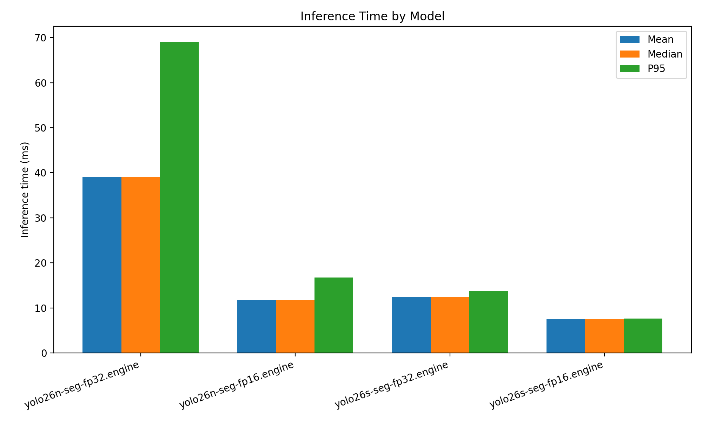
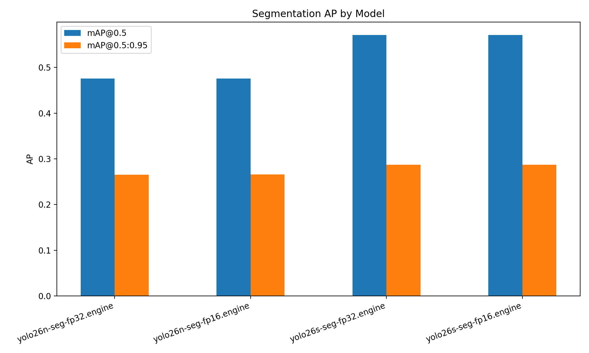
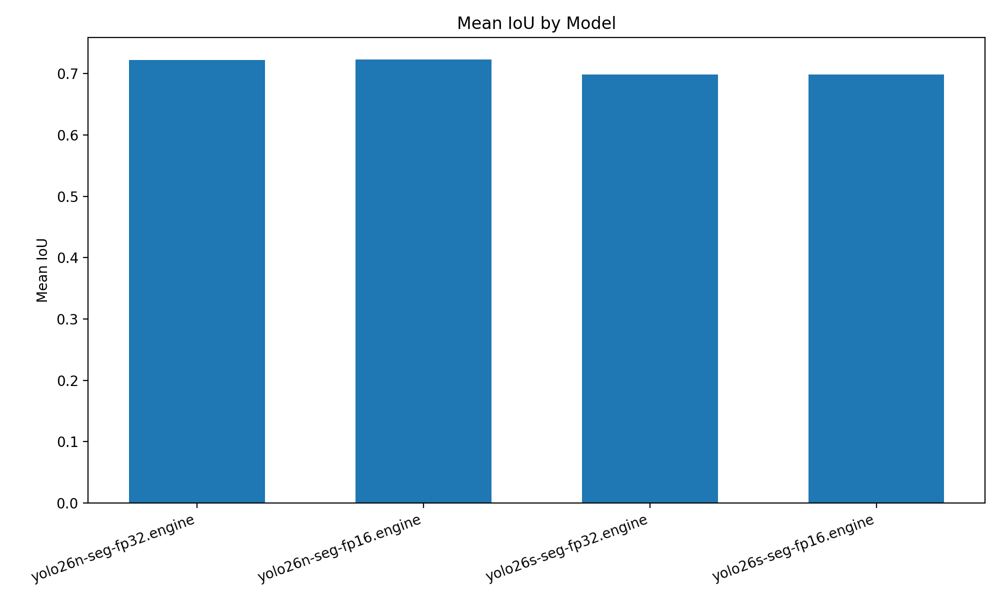
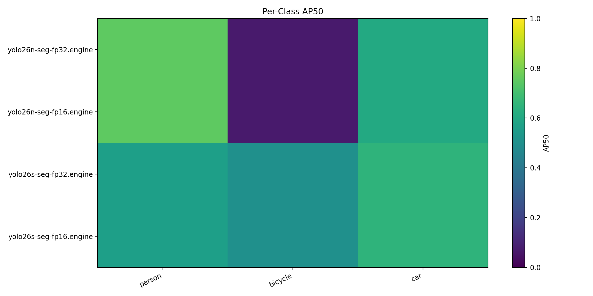
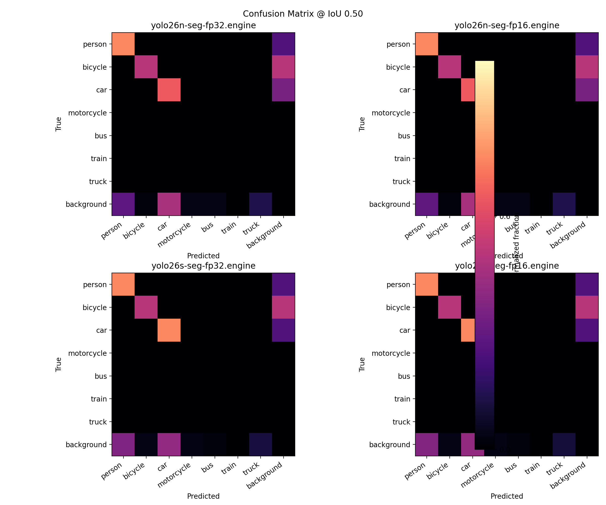

# Cityscapes Segmentation Benchmark

- Dataset root: `/home/intellisense05/akinduid/mi/datasets`
- Split: `val`
- Image pairs evaluated: `2`
- Max images: `2`

## Summary

| Model                   | Mean ms | Median ms | P95 ms | FPS    | Mean IoU | Prec@0.5 | Rec@0.5 | F1@0.5 | mAP@0.5 | mAP@0.5:0.95 | Eval mode              | Best F1@0.5 | Best conf@0.5 |
| ----------------------- | ------- | --------- | ------ | ------ | -------- | -------- | ------- | ------ | ------- | ------------ | ---------------------- | ----------- | ------------- |
| yolo26n-seg-fp32.engine | 39.04   | 39.04     | 69.08  | 25.62  | 0.7224   | 0.0666   | 0.6333  | 0.1166 | 0.4757  | 0.2652       | native-trt-class-aware | 0.5890      | 0.1408        |
| yolo26n-seg-fp16.engine | 11.70   | 11.70     | 16.78  | 85.51  | 0.7230   | 0.0666   | 0.6333  | 0.1167 | 0.4757  | 0.2661       | native-trt-class-aware | 0.5890      | 0.1409        |
| yolo26s-seg-fp32.engine | 12.44   | 12.44     | 13.72  | 80.36  | 0.6985   | 0.0711   | 0.6667  | 0.1254 | 0.5710  | 0.2873       | native-trt-class-aware | 0.7146      | 0.3505        |
| yolo26s-seg-fp16.engine | 7.44    | 7.44      | 7.60   | 134.43 | 0.6984   | 0.0711   | 0.6667  | 0.1254 | 0.5709  | 0.2873       | native-trt-class-aware | 0.7146      | 0.3504        |

Engine models may use class-agnostic fallback when class/conf fields are incompatible.

## Plots

## Per-Class AP50

| Model                   | person | bicycle | car    |
| ----------------------- | ------ | ------- | ------ |
| yolo26n-seg-fp32.engine | 0.7500 | 0.0714  | 0.6055 |
| yolo26n-seg-fp16.engine | 0.7500 | 0.0714  | 0.6055 |
| yolo26s-seg-fp32.engine | 0.5625 | 0.5000  | 0.6505 |
| yolo26s-seg-fp16.engine | 0.5625 | 0.5000  | 0.6503 |

## Threshold View

| Model                   | Best F1@0.5 | Best conf@0.5 |
| ----------------------- | ----------- | ------------- |
| yolo26n-seg-fp32.engine | 0.5890      | 0.1408        |
| yolo26n-seg-fp16.engine | 0.5890      | 0.1409        |
| yolo26s-seg-fp32.engine | 0.7146      | 0.3505        |
| yolo26s-seg-fp16.engine | 0.7146      | 0.3504        |

## Outputs

- JSON: [`benchmark_results.json`](benchmark_results.json)
- CSV: [`benchmark_results.csv`](benchmark_results.csv)
- Plots directory: [`plots/`](plots)

## Notes

- `Prec@0.5` and `Rec@0.5` are the final-point values on the ranked prediction curve, so low precision with high recall can happen when many low-confidence false positives are retained.
- `Best F1@0.5` shows the strongest confidence operating point for each model and is usually a better sanity check for imbalance than the final-point precision alone.