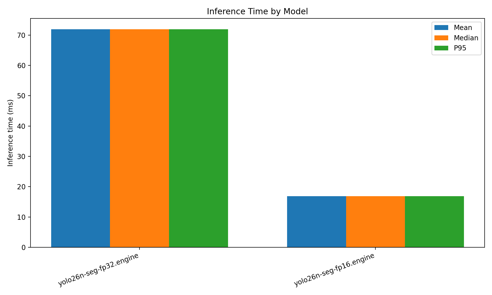
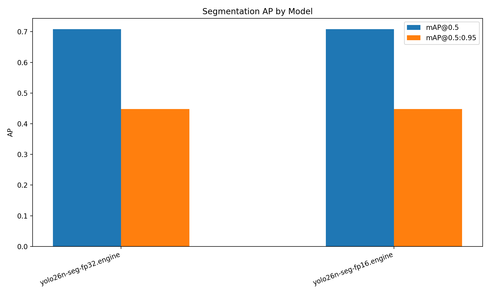
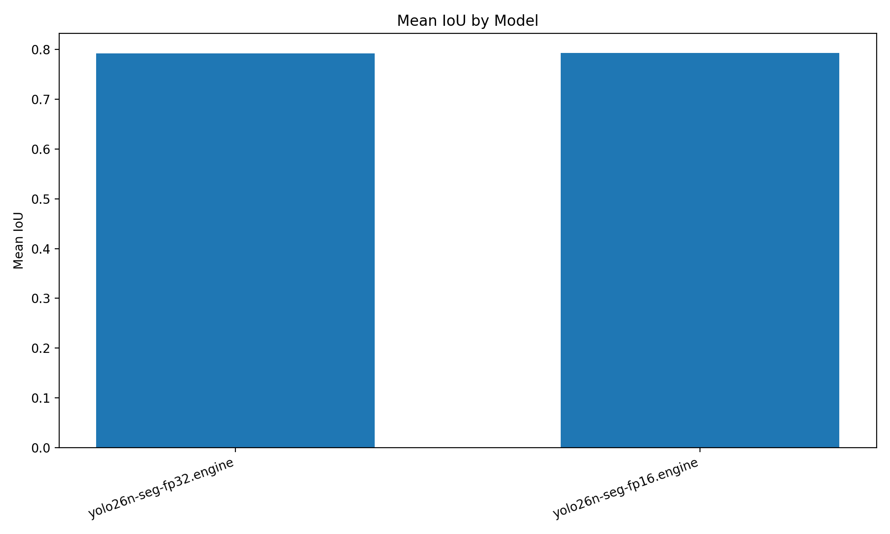
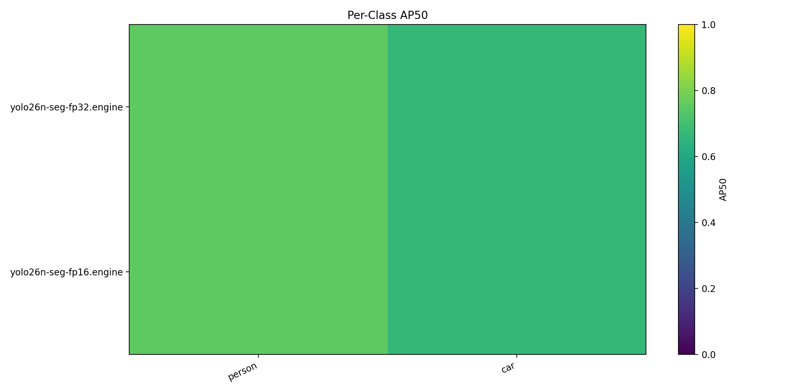

# Cityscapes Segmentation Benchmark

- Dataset root: `/home/intellisense05/akinduid/mi/datasets`
- Split: `val`
- Image pairs evaluated: `1`
- Max images: `1`

## Summary

| Model                   | Mean ms | Median ms | P95 ms | FPS   | Mean IoU | Prec@0.5 | Rec@0.5 | F1@0.5 | mAP@0.5 | mAP@0.5:0.95 | Eval mode              |
| ----------------------- | ------- | --------- | ------ | ----- | -------- | -------- | ------- | ------ | ------- | ------------ | ---------------------- |
| yolo26n-seg-fp32.engine | 71.91   | 71.91     | 71.91  | 13.91 | 0.7919   | 0.0467   | 0.7083  | 0.0873 | 0.7083  | 0.4479       | native-trt-class-aware |
| yolo26n-seg-fp16.engine | 16.87   | 16.87     | 16.87  | 59.27 | 0.7929   | 0.0461   | 0.7083  | 0.0864 | 0.7083  | 0.4479       | native-trt-class-aware |

Engine models may use class-agnostic fallback when class/conf fields are incompatible.

## Plots

## Per-Class AP50

| Model                   | person | car    |
| ----------------------- | ------ | ------ |
| yolo26n-seg-fp32.engine | 0.7500 | 0.6667 |
| yolo26n-seg-fp16.engine | 0.7500 | 0.6667 |

## Outputs

- JSON: [`benchmark_results.json`](benchmark_results.json)
- CSV: [`benchmark_results.csv`](benchmark_results.csv)
- Plots directory: [`plots/`](plots)