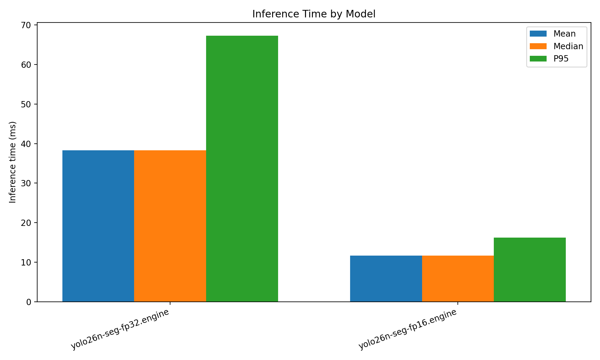
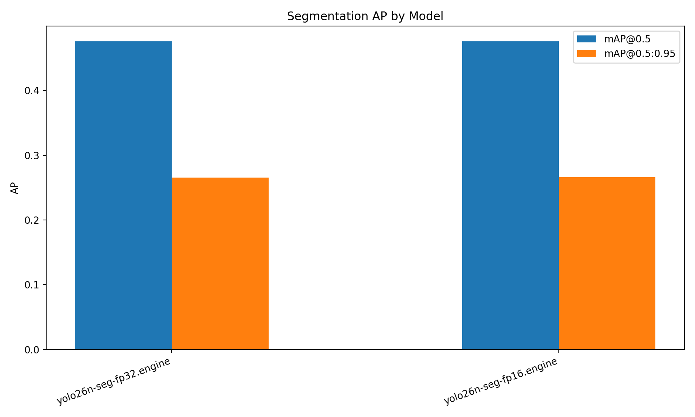
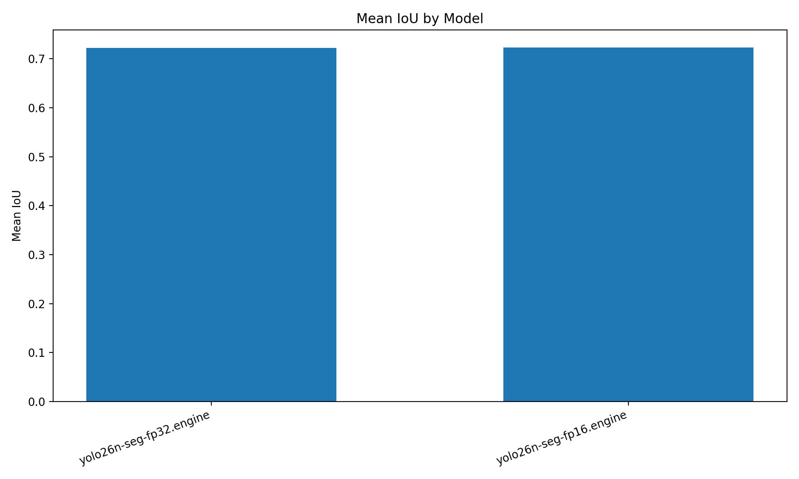
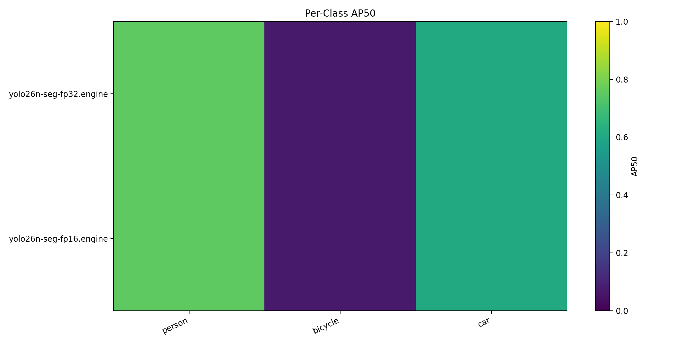

# Cityscapes Segmentation Benchmark

- Dataset root: `/home/intellisense05/akinduid/mi/datasets`
- Split: `val`
- Image pairs evaluated: `2`
- Max images: `2`

## Summary

| Model                   | Mean ms | Median ms | P95 ms | FPS   | Mean IoU | Prec@0.5 | Rec@0.5 | F1@0.5 | mAP@0.5 | mAP@0.5:0.95 | Eval mode              |
| ----------------------- | ------- | --------- | ------ | ----- | -------- | -------- | ------- | ------ | ------- | ------------ | ---------------------- |
| yolo26n-seg-fp32.engine | 38.31   | 38.31     | 67.29  | 26.10 | 0.7224   | 0.0666   | 0.6333  | 0.1166 | 0.4757  | 0.2652       | native-trt-class-aware |
| yolo26n-seg-fp16.engine | 11.65   | 11.65     | 16.22  | 85.87 | 0.7230   | 0.0666   | 0.6333  | 0.1167 | 0.4757  | 0.2661       | native-trt-class-aware |

Engine models may use class-agnostic fallback when class/conf fields are incompatible.

## Plots

## Per-Class AP50

| Model                   | person | bicycle | car    |
| ----------------------- | ------ | ------- | ------ |
| yolo26n-seg-fp32.engine | 0.7500 | 0.0714  | 0.6055 |
| yolo26n-seg-fp16.engine | 0.7500 | 0.0714  | 0.6055 |

## Outputs

- JSON: [`benchmark_results.json`](benchmark_results.json)
- CSV: [`benchmark_results.csv`](benchmark_results.csv)
- Plots directory: [`plots/`](plots)