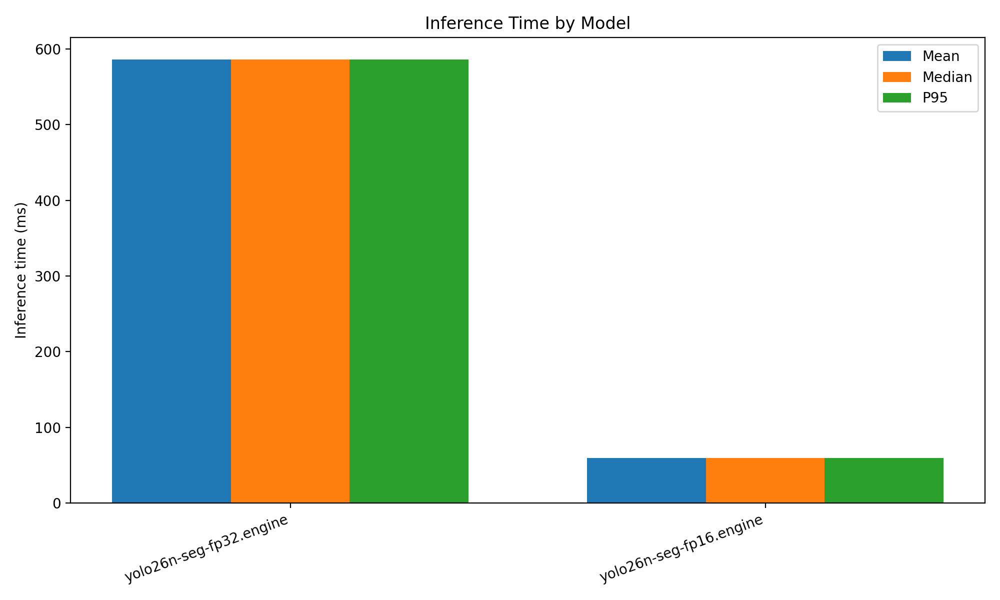
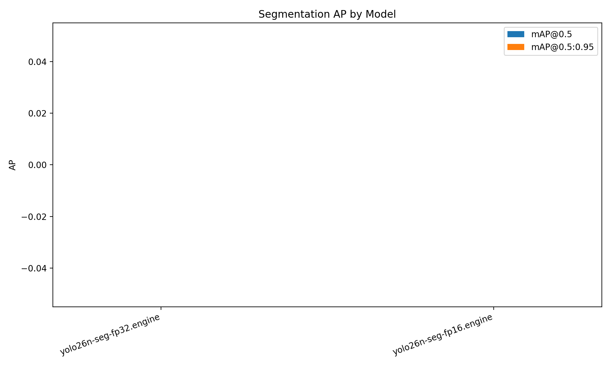
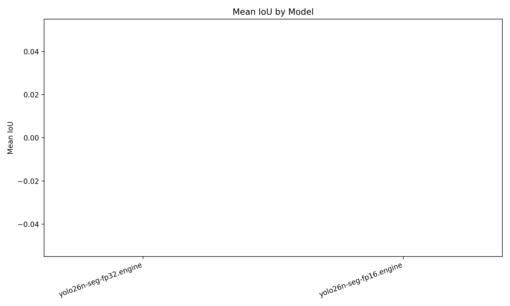
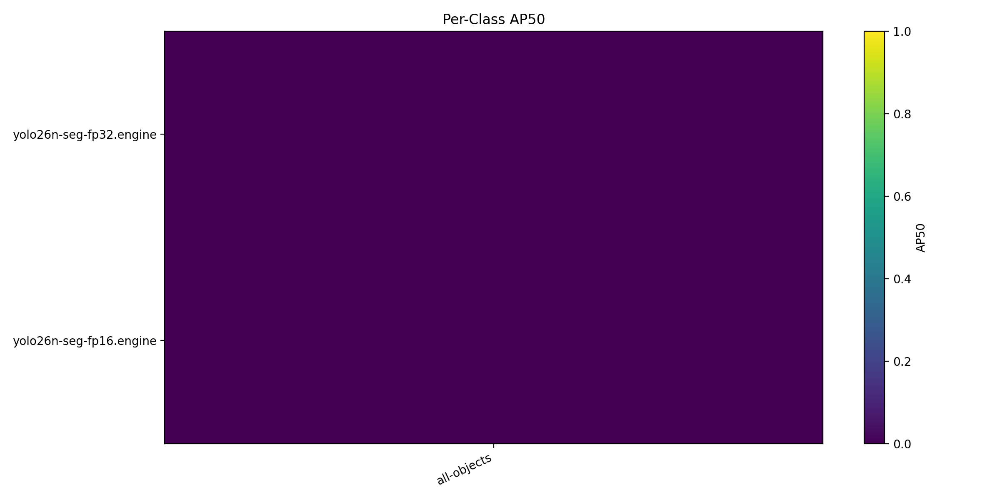

# Cityscapes Segmentation Benchmark

- Dataset root: `/home/intellisense05/akinduid/mi/datasets`
- Split: `val`
- Image pairs evaluated: `1`
- Max images: `1`

## Summary

| Model                   | Mean ms | Median ms | P95 ms | FPS   | Mean IoU | Prec@0.5 | Rec@0.5 | F1@0.5 | mAP@0.5 | mAP@0.5:0.95 | Eval mode      |
| ----------------------- | ------- | --------- | ------ | ----- | -------- | -------- | ------- | ------ | ------- | ------------ | -------------- |
| yolo26n-seg-fp32.engine | 586.21  | 586.21    | 586.21 | 1.71  | 0.0000   | 0.0000   | 0.0000  | 0.0000 | 0.0000  | 0.0000       | class-agnostic |
| yolo26n-seg-fp16.engine | 59.12   | 59.12     | 59.12  | 16.92 | 0.0000   | 0.0000   | 0.0000  | 0.0000 | 0.0000  | 0.0000       | class-agnostic |

Engine models may use class-agnostic fallback when class/conf fields are incompatible.

## Plots

## Per-Class AP50

| Model                   | all-objects |
| ----------------------- | ----------- |
| yolo26n-seg-fp32.engine | 0.0000      |
| yolo26n-seg-fp16.engine | 0.0000      |

## Outputs

- JSON: [`benchmark_results.json`](benchmark_results.json)
- CSV: [`benchmark_results.csv`](benchmark_results.csv)
- Plots directory: [`plots/`](plots)