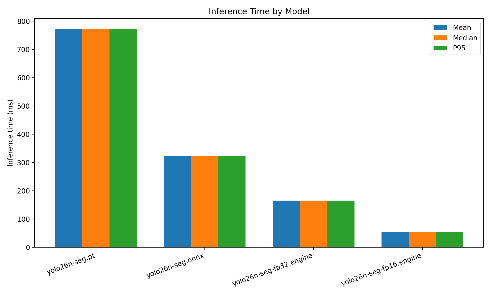
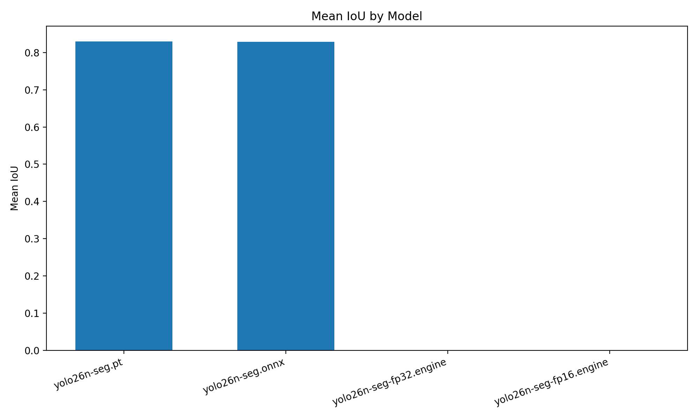
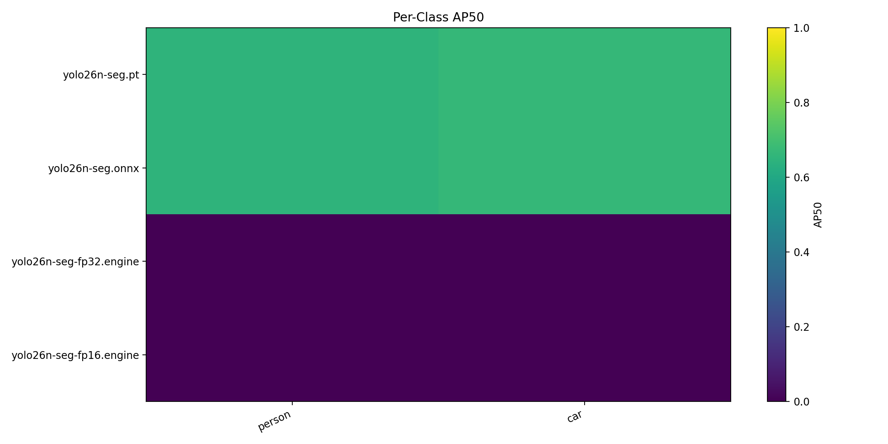

# Cityscapes Segmentation Benchmark

- Dataset root: `/home/intellisense05/akinduid/mi/datasets`
- Split: `val`
- Image pairs evaluated: `1`
- Max images: `1`

## Summary

| Model                   | Mean ms | Median ms | P95 ms | FPS   | Mean IoU | Prec@0.5 | Rec@0.5 | F1@0.5 | mAP@0.5 | mAP@0.5:0.95 |
| ----------------------- | ------- | --------- | ------ | ----- | -------- | -------- | ------- | ------ | ------- | ------------ |
| yolo26n-seg.pt          | 771.41  | 771.41    | 771.41 | 1.30  | 0.8298   | 0.0364   | 0.6667  | 0.0690 | 0.6583  | 0.3007       |
| yolo26n-seg.onnx        | 321.43  | 321.43    | 321.43 | 3.11  | 0.8290   | 0.0345   | 0.6667  | 0.0656 | 0.6583  | 0.3007       |
| yolo26n-seg-fp32.engine | 165.24  | 165.24    | 165.24 | 6.05  | 0.0000   | 0.0000   | 0.0000  | 0.0000 | 0.0000  | 0.0000       |
| yolo26n-seg-fp16.engine | 54.81   | 54.81     | 54.81  | 18.24 | 0.0000   | 0.0000   | 0.0000  | 0.0000 | 0.0000  | 0.0000       |

## Plots

## Per-Class AP50

| Model                   | person | car    |
| ----------------------- | ------ | ------ |
| yolo26n-seg.pt          | 0.6500 | 0.6667 |
| yolo26n-seg.onnx        | 0.6500 | 0.6667 |
| yolo26n-seg-fp32.engine | 0.0000 | 0.0000 |
| yolo26n-seg-fp16.engine | 0.0000 | 0.0000 |

## Outputs

- JSON: [`benchmark_results.json`](benchmark_results.json)
- CSV: [`benchmark_results.csv`](benchmark_results.csv)
- Plots directory: [`plots/`](plots)