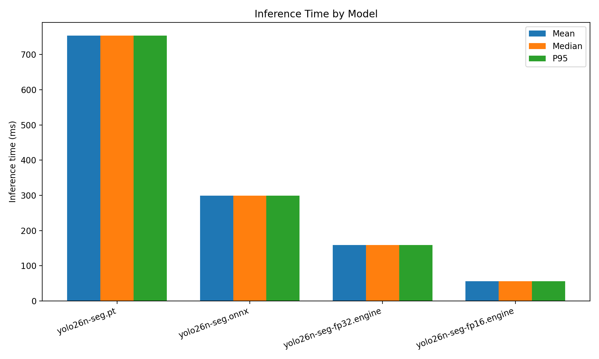
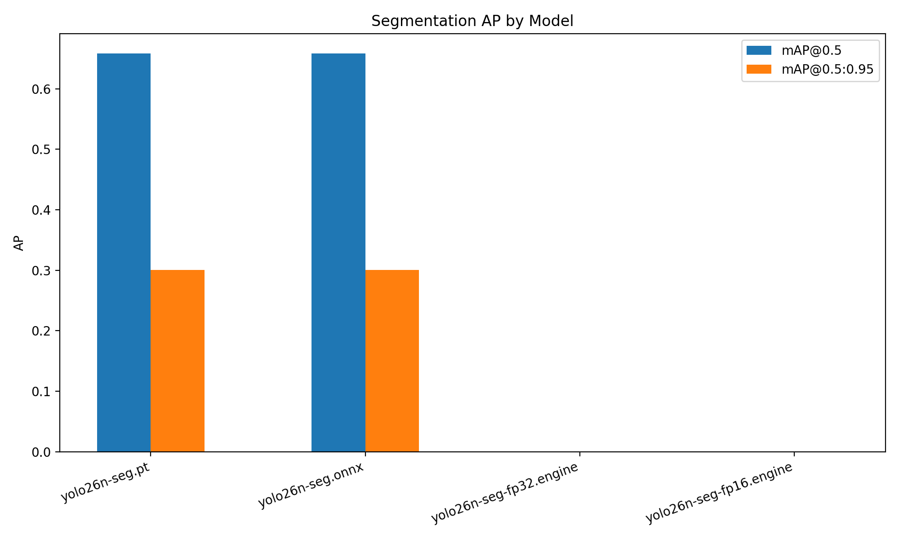
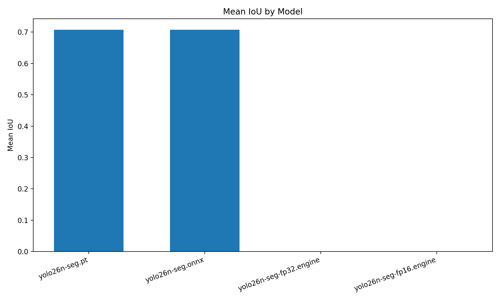
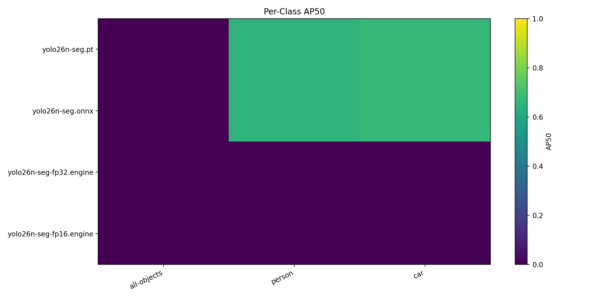

# Cityscapes Segmentation Benchmark

- Dataset root: `/home/intellisense05/akinduid/mi/datasets`
- Split: `val`
- Image pairs evaluated: `1`
- Max images: `1`

## Summary

| Model                   | Mean ms | Median ms | P95 ms | FPS   | Mean IoU | Prec@0.5 | Rec@0.5 | F1@0.5 | mAP@0.5 | mAP@0.5:0.95 | Eval mode      |
| ----------------------- | ------- | --------- | ------ | ----- | -------- | -------- | ------- | ------ | ------- | ------------ | -------------- |
| yolo26n-seg.pt          | 753.77  | 753.77    | 753.77 | 1.33  | 0.7073   | 0.0488   | 0.7083  | 0.0911 | 0.6583  | 0.3007       | class-aware    |
| yolo26n-seg.onnx        | 298.79  | 298.79    | 298.79 | 3.35  | 0.7075   | 0.0467   | 0.7083  | 0.0873 | 0.6583  | 0.3007       | class-aware    |
| yolo26n-seg-fp32.engine | 158.72  | 158.72    | 158.72 | 6.30  | 0.0000   | 0.0000   | 0.0000  | 0.0000 | 0.0000  | 0.0000       | class-agnostic |
| yolo26n-seg-fp16.engine | 55.72   | 55.72     | 55.72  | 17.95 | 0.0000   | 0.0000   | 0.0000  | 0.0000 | 0.0000  | 0.0000       | class-agnostic |

Engine models may use class-agnostic fallback when class/conf fields are incompatible.

## Plots

## Per-Class AP50

| Model                   | all-objects | person | car    |
| ----------------------- | ----------- | ------ | ------ |
| yolo26n-seg.pt          | 0.0000      | 0.6500 | 0.6667 |
| yolo26n-seg.onnx        | 0.0000      | 0.6500 | 0.6667 |
| yolo26n-seg-fp32.engine | 0.0000      | 0.0000 | 0.0000 |
| yolo26n-seg-fp16.engine | 0.0000      | 0.0000 | 0.0000 |

## Outputs

- JSON: [`benchmark_results.json`](benchmark_results.json)
- CSV: [`benchmark_results.csv`](benchmark_results.csv)
- Plots directory: [`plots/`](plots)